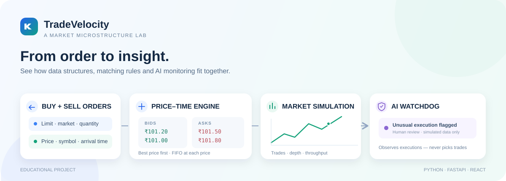

# TradeVelocity

<p align="center">
  <strong>High-Performance Stock Market Order Matching Engine with Advanced Data Structures, Market Simulation and AI Analytics</strong>
</p>

<p align="center">
  Learn how a market matches orders, explore the data structures that power an order book, and watch an AI “cyber-police” monitor simulated executions — all in one interactive app.
</p>

<p align="center">
  
  
  
  
  
</p>

<p align="center">
  <a href="https://github.com/sgshiv001/TRADE-VELOCITY/releases/latest">🪟 Download Windows app</a> ·
  <a href="#run-the-app">🚀 Run from source</a> ·
  <a href="#show-how-it-works">🎓 Classroom demo</a> ·
  <a href="docs/architecture.md">🧩 Architecture</a> ·
  <a href="docs/results.md">📊 Results</a> ·
  <a href="CHANGELOG.md">📝 Changelog</a>
</p>

<p align="center">
  
</p>

> **A safe market lab, not a trading platform.** TradeVelocity uses simulated orders and virtual funds; it does not connect to a real exchange or place real trades.

## The project in one minute

**TradeVelocity** combines *trade* (buying and selling shares) with *velocity* (the speed and flow of orders). The name captures the project goal: explore efficient order processing while preserving correct, fair matching.

Markets must pair compatible buyers and sellers, give better prices priority, preserve arrival order at equal prices, and handle partial fills and cancellations. Repeatedly scanning a simple list can become costly as an order book grows. This project makes those choices visible: compare a list-based reference with an indexed engine, simulate realistic command flows, and inspect the outcome in a polished desktop or browser interface.

| Explore | What you learn |
| --- | --- |
| **Matching engine** | Price-time priority, market and limit orders, partial fills, and cancellations |
| **Data structures** | Heaps, FIFO queues, hash tables, AVL trees, and Fenwick trees in an order book |
| **Market simulation** | Repeatable workloads, trades, order-book depth, volume, and measured comparisons |
| **AI “cyber-police”** | A separate watchdog flags unusual simulated executions for human review; it never changes matching decisions |

AI results are educational and synthetic—not proof of fraud, a prediction, or a claim of real-market accuracy. [See measured results and limitations](docs/results.md).

## Get started

On Windows, double-click **Launch_Desktop.vbs** to open the packaged app if its build is present. To run from source, install Python 3.10+ and Node.js/npm, then:

```powershell
python -m venv .venv
.\.venv\Scripts\python.exe -m pip install -e ".[app,test]"
.\.venv\Scripts\python.exe app.py
```

The browser launcher asks you to choose a browser and builds the frontend automatically. For a dedicated Windows desktop build, install `.[app,test,desktop]` and run `scripts/build_desktop.py`. Full setup, shortcuts, and packaging notes are in [Run the app](#run-the-app).

## What does TradeVelocity mean?

**Trade** means buying and selling shares. **Velocity** represents the speed and flow of orders through the system. Together, **TradeVelocity** describes the project's goal: process orders efficiently while keeping every match correct and fair.

The name describes the idea behind the project. Performance is demonstrated by measured benchmarks rather than a promise about real exchange speed.

## What problem does this project solve?

A stock market receives many buy and sell orders at different prices and times. The system must find a compatible buyer and seller, select the best price first, preserve arrival order at the same price, handle partial fills and cancellations, and keep the order book accurate.

A simple implementation repeatedly scans unsorted lists. That work becomes expensive as the number of price levels grows. TradeVelocity studies how custom data structures organize these operations and compares the indexed approach with a list-based reference. Small books can still favor the simpler list, so both results are reported.

The project brings together three parts:

1. **Matching engine:** correctly execute compatible orders using price-time priority.
2. **Market simulation:** generate repeatable workloads and inspect their trades, depth, volume, and performance.
3. **AI analytics:** monitor simulated executions against a fixed baseline, and separately explore unusual historical observations. AI never changes the engine's matching decisions.

This is a learning and experimentation project. It uses simulated orders and virtual funds, not a live exchange or real-money trading.

## What is included?

- Limit and market orders, partial fills, cancellation, modification, and multiple symbols.
- Order-book depth, trade history, VWAP, and volume queries.
- Custom heaps, FIFO queues, hash tables, AVL trees, and Fenwick trees.
- A clean light-first React interface with saved light/dark themes, order entry, simulation, execution alerts, benchmarks, and history.
- A dedicated Windows window and a portable executable build that bundles Python and the production frontend.
- A classroom watchdog demo with separate training/test observations, explicit injected labels, precision, recall, missed spikes, and false alarms.
- Historical data for eight NSE companies and an Isolation Forest analysis pipeline.
- A paper-account API with local JSON session persistence.
- Repeatable tests and benchmark CSVs with documented workloads.

## Run the app

### Windows desktop app — no browser or console needed

Download the latest **TradeVelocity-Windows-x64.zip** from [GitHub Releases](https://github.com/sgshiv001/TRADE-VELOCITY/releases/latest), extract it, then double-click the included **Launch_Desktop.vbs**. Keep the extracted `TradeVelocity` folder intact; the app needs its `_internal` support files. Windows may show a security warning because this educational build is unsigned.

If the desktop build is already present, double-click **Launch_Desktop.vbs** in this folder, or open **dist/TradeVelocity/TradeVelocity.exe**. It opens a normal resizable Windows window. Closing that window stops its own local server. Light mode is the default; the theme button switches to dark mode and saves your choice.

To prepare or rebuild it from source:

```powershell
.\.venv\Scripts\python.exe -m pip install -e ".[app,test,desktop]"
.\.venv\Scripts\python.exe scripts/build_desktop.py
```

The build machine needs Python and Node/npm. The resulting **whole `dist/TradeVelocity` folder** can be copied to another compatible Windows PC; do not copy just the EXE. The target PC needs Microsoft Edge WebView2 Runtime, but not a separate Python or Node installation. This is an unsigned portable app, not a signed installer. Do not bypass security warnings; a distributable signed installer remains a separate release task.

Desktop sessions, webview storage, and diagnostics live in `%LOCALAPPDATA%\TradeVelocity`. The desktop binds only to loopback, preferably port 8765, and uses a free port if that port is occupied. Browser mode retains its existing `.marketlab/sessions` storage. The two modes have separate accounts. Source launch is also available with `python app.py --desktop`.

### Browser / VS Code mode

**Windows shortcut:** after the setup below, double-click `Launch_TradeVelocity.bat`
inside this project folder. It runs `app.py` using the project's `.venv`, keeps
browser selection, and leaves startup errors visible. Keep its window open while
using the app; press **Ctrl+C** to stop.

You need **Python 3.10+** and **Node.js 22 with npm**. In PowerShell, from the project folder:

```powershell
python -m venv .venv
.\.venv\Scripts\python.exe -m pip install -e ".[app,test]"
.\.venv\Scripts\python.exe app.py
```

Choose Edge, Chrome, Firefox, or your default browser when prompted. The launcher installs missing frontend dependencies, builds the UI, starts FastAPI, and opens `http://127.0.0.1:8000`. Keep the terminal open; **Ctrl+C** stops the server.

In VS Code, select **TradeVelocity: Run App** and press **F5**. Your existing folder named `ADSA PROJECT` is this same project; no second or nested project folder is needed.

For macOS/Linux, use `.venv/bin/python` instead of `.venv\Scripts\python.exe`.

Useful options: `--skip-build` reuses the previous frontend build, `--port 8001` selects another port, and `--no-browser` lets you open the address manually.

## Show how it works

```powershell
.\.venv\Scripts\python.exe demoapp.py
```

`demoapp.py` executes and checks real engine examples: multi-price matching, FIFO priority, partial fills, cancellation, and statistics. It then opens the same application for your presentation.

For a terminal-only demonstration:

```powershell
.\.venv\Scripts\python.exe demoapp.py --terminal-only
```

Select **ENTER ENGINE**, click **Load demo flow**, then inspect **Order Book** and **History**. Submit a buy or sell from the Order Book ticket. The Simulator executes its selected workload through the backend instead of animating counters.

For the AI demonstration, open **Watchdog → Run classroom demo** and confirm replacing the lab. The model trains on 40 normal executions, scores 50 unseen executions containing 10 injected spikes, and displays detection results and traceable alerts. The paper portfolio is not changed. **Historical AI** remains a separate view of dated daily market data.

Use **Benchmark** to run mixed, deep-book, or cancellation comparisons with three repetitions. **History → Export session** saves all commands; **Reset lab** starts a fresh experiment after confirmation. History displays the newest 100 trades.

There are only two Python application entry files: **app.py** to launch and **demoapp.py** to demonstrate. **Launch_TradeVelocity.bat** is the Windows double-click shortcut to `app.py`. The folders below contain the code and evidence those files need.

## How the engine works

An incoming order checks the best compatible price on the opposite side. It matches the oldest order at that price and executes at the resting order's price. It continues until filled or liquidity runs out. Unfilled limit quantities remain on the book; unfilled market quantities expire.

| Data structure | Job |
| --- | --- |
| Min/max binary heaps | Find the best ask and bid |
| FIFO queues | Preserve time priority at one price |
| Hash tables | Find orders and price levels |
| AVL trees | Keep price levels ordered for depth queries |
| Fenwick trees | Calculate cumulative and range trading volume |

See [architecture and complexity](docs/architecture.md) for the algorithm, invariants, and costs.

## AI and demo limitations

Both AI views use **StandardScaler + Isolation Forest**. The execution watchdog trains only on the first 40 executed-order observations for a symbol, then scores later observations without refitting on them. Its seven measurements use actual matched shares, executed-price change, execution count, submitted quantity, and pre-command bid/ask depth (top 30 levels) and imbalance. Measurements listed on alerts are standardized deviations, not causal explanations. Its display score is not a probability. Normality of the first baseline is an assumption; this is an educational detector, not production surveillance.

The separate historical AI fits and scores the same OHLCV window. Its order-flow fields remain documented proxies. Neither view proves fraud, predicts future prices, blocks orders, or decides which orders trade.

The simulator now submits real workloads (10–2,000 commands per request), controlled by scenario, seed, buy probability, and market-order percentage. It adds to the current book, so use a fresh lab to compare reproducible runs. Its measured time includes session telemetry and is distinct from an isolated engine benchmark. DSA diagrams and some historical analytics widgets remain illustrative. The paper-account API has more capabilities than the UI exposes.

The bundled market snapshot is dated, not a live feed. Its metadata records the source/date, and failed refreshes preserve the existing data. Local account sessions are saved under `.marketlab/` and excluded from Git. Source-code licensing does not replace the market provider's data terms.

## Tests and experiments

Build the frontend before running the full suite:

```powershell
cd frontend
npm ci
npm run build
cd ..
.\.venv\Scripts\python.exe -m pytest -q
```

Actual concurrent simulation and a controlled benchmark:

```powershell
.\.venv\Scripts\python.exe -m stock_engine.cli simulate --orders 10000 --workers 4 --seed 42
.\.venv\Scripts\python.exe scripts/compare_engines.py --sizes 1000,5000,10000 --workloads mixed,deep,cancel --repeats 3 --trace-memory
.\.venv\Scripts\python.exe scripts/evaluate_watchdog.py --seed 42
```

See [evaluation methods](docs/evaluation.md) and [recorded results](docs/results.md). API documentation is available at `http://127.0.0.1:8000/docs` while the app runs.

## Project structure

```text
app.py                  Launch the complete app
demoapp.py              Verified examples + classroom launch
Launch_TradeVelocity.bat Windows double-click shortcut to app.py
Launch_Desktop.vbs      Open the packaged Windows app (or source desktop)
TradeVelocity.spec      Reproducible Windows packaging configuration
frontend/               React and TypeScript interface
src/stock_engine/       Matching, data structures, API, data, and AI
scripts/                Benchmark and market-data tools
scenarios/              Reproducible matching scenario
benchmarks/             Recorded measurement CSVs
tests/                  Correctness and startup checks
docs/                   Architecture, results, and development history
pyproject.toml          Python package and dependencies
```

Older launcher names and the legacy Streamlit/setup files were removed. Their committed history remains available in Git. Update [CHANGELOG.md](CHANGELOG.md) for future changes; [the development log](docs/development-log.md) preserves the implementation history.

## License

Project source is licensed under [MIT](LICENSE).
