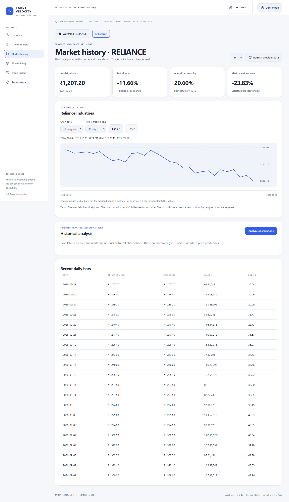
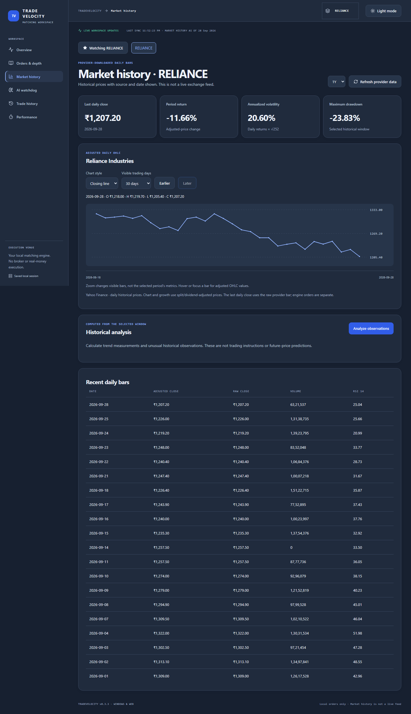

# TradeVelocity

<strong>High-Performance Stock Market Order Matching Engine with Advanced Data Structures, Market Simulation and AI Analytics</strong>

One matching workspace. Windows desktop and browser. Your orders, your order book, your execution records.

  
  
  
  
  

## Current status — 0.3.3

**Tested and working on the maintainer's Windows 11 x64 PC.** The local web app
and packaged Windows app passed the recorded verification on **1 October 2026**:

- **159 Python tests** and **10 real-browser tests** passed.
- Production UI build, order matching, saved-data/retry checks, AI review,
  light/dark themes and responsive layouts passed.
- The extracted Windows ZIP launched without Python or Node.js on PATH, rendered
  the interface, matched orders, checked the AI regressions, recovered from an
  occupied port and shut down its own server.

These results establish working tested flows on this PC, not a guarantee of
zero bugs or compatibility with every computer. The app remains local and the
Windows build is unsigned; AI results are controlled tests, not certified fraud
detection. [Full completion report](docs/completion-report.md) ·
[Windows setup and release guide](docs/windows-release.md).

## What the app does

TradeVelocity is a working local order-matching application, not a broker-connected trading platform. Submit your own limit or market orders, inspect depth, amend or cancel orders, and review executions generated by the actual matching engine. The same React + FastAPI application runs in a dedicated Windows window or a browser.

**No real money or securities are transferred.** Orders stay in your local session. A company symbol does not route an order to NSE, a broker, or another user's session. Market history and your engine's order book are separate data sources.

New sessions start empty. There are no preset trades, generated market prices, classroom controls, presentation launchers, or automatic counterparties. Your existing saved session remains available; clearing it requires confirmation.

## Meaning of the name and the problem

**Trade** means buying and selling. **Velocity** describes the speed and flow of orders through the system.

An order book must select the best compatible price, preserve arrival order at the same price, handle partial fills and cancellations, and keep every quantity correct. Repeatedly scanning unsorted price levels can become expensive as a book grows. TradeVelocity uses indexed data structures and compares its outcomes and measured throughput with a list-based reference. It does not claim exchange-grade speed or production fraud detection.

## Features

| Workspace | Working behavior |
| --- | --- |
| Overview | Actual open-order count, trade count, matched shares, VWAP, and latest execution |
| Orders & depth | Buy/sell limit and market orders; partial fills; amendment and cancellation; depth by symbol |
| Market history | Downloaded daily company history, explicit source/date, adjusted chart, volatility, drawdown, RSI, and recent bars |
| AI watchdog | Unusual-execution alerts computed from your own matching activity, with exportable reports |
| Trade history | Search and pagination across every trade, full CSV export, session export/import, and confirmed clearing |
| Performance | Measured indexed/linear comparisons in isolated engines, without changing your active orders |
| Windows & web | Shared application code, saved light/dark themes, responsive interface, and persistent local sessions |

Custom engine symbols are supported. Provider history is available only for the eight configured NSE companies: RELIANCE, TCS, INFY, HDFCBANK, ICICIBANK, BHARTIARTL, LT, and ITC.

The original project title includes market simulation. Generated workloads are now restricted to developer measurements; the application no longer injects them into the active order book.

## Interface preview

Actual market-history screens captured during isolated browser QA, not mockups.
They use the downloaded historical snapshot; neither theme changes matching.

**Light mode**

View dark mode

## Run the web app

Install Python 3.10+ and Node.js 22/npm. From this existing project folder:

~~~powershell
python -m venv .venv
.\.venv\Scripts\python.exe -m pip install -e ".[app,test]"
.\.venv\Scripts\python.exe app.py
~~~

Choose a browser when prompted. The launcher builds the UI, starts FastAPI, and opens the local website at http://127.0.0.1:8000. Keep the terminal open and press Ctrl+C to stop it. Double-click **Launch_TradeVelocity.bat** for the folder shortcut.

In VS Code, select **TradeVelocity: Run App** and press F5. Use another port if needed:

~~~powershell
.\.venv\Scripts\python.exe app.py --port 8001 --browser edge
~~~

This web version stays local. It rejects untrusted hosts, foreign browser origins,
and non-loopback clients. [Private-hosting tooling](docs/private-deployment.md)
adds opt-in single-operator access protection and HTTPS-proxy templates; it has
not been deployed or container-tested. It is not a public multi-user service.

## Run the Windows app

For a source desktop launch:

~~~powershell
.\.venv\Scripts\python.exe -m pip install -e ".[app,test,desktop]"
.\.venv\Scripts\python.exe app.py --desktop
~~~

To build the portable Windows application:

~~~powershell
.\.venv\Scripts\python.exe scripts/build_desktop.py
~~~

Double-click **Launch_Desktop.vbs** in the project folder, or open
**dist/TradeVelocity/TradeVelocity.exe** after building. The builder also creates
**dist/TradeVelocity-Windows-x64.zip** and a hash/integrity manifest. Extract the
entire ZIP; do not copy only the EXE. The target Windows computer needs WebView2
and .NET Framework 4.6.2+, not Python or Node. Run `app.py --check-system` or the
packaged EXE's `--check-system` for read-only prerequisite diagnostics. This
remains an unsigned portable build; certificate-store signing tools are prepared
but no publisher certificate was supplied. See the
[Windows release checklist](docs/windows-release.md).

The Windows app binds only to loopback, selects an available port, and stops its own server when its window closes. Desktop storage lives under %LOCALAPPDATA%\TradeVelocity; browser storage lives under .marketlab. These modes have separate local sessions.

## Using your matching engine

1. Open **Orders & depth** and choose a company or enter a custom symbol.
2. Submit the orders you want to match. A trade requires compatible orders on opposite sides.
3. Inspect the remaining quantities, depth, and execution acknowledgement.
4. Amend an active order or cancel it. An amendment sets a new open quantity and resets time priority.
5. Open **Trade history** to search, export, or restore your session.

A market order cannot fill without opposite-side liquidity. Its unfilled quantity expires. A limit order's unfilled quantity remains on the book. Trades execute at the resting order's price.

Orders are saved automatically; exports include every successful command for replay. Imported orders are validated by the engine before replacing the current session. Replay reconstructs execution features and timestamps rather than trusting imported telemetry. Legacy virtual-account records are retained on disk but are no longer operated by the application.

## Market data and AI boundaries

**Market history is real provider-downloaded daily history, not a live quote feed.** The date and source are visible. Select **Market history → Refresh provider data** to download available updates. A failed refresh preserves the existing snapshot and your orders. A missing or invalid snapshot shows an unavailable state; prices are never fabricated. Refreshed history is stored in writable application storage so it survives a desktop rebuild.

The execution watchdog combines a corroborated Isolation Forest signal with
robust-deviation and raw-count-envelope guards. The first 40 executed-order
observations form a fixed baseline: 24 fit the detector and 16 calibrate its
cutoffs. Only later observations are scored. Baseline normality is an assumption;
a repetitive or poisoned baseline can limit detection. Alerts identify which
detector fired and can be reviewed/dismissed with saved notes. Scores are
severity, not fraud probabilities. AI never blocks orders or changes matching.

The [AI calibration test report](docs/ai-calibration-report.md) describes threshold selection on development workloads and testing on separate seeds. Its figures measure **controlled matching-engine deviations, not real-market fraud accuracy**. Reproduce it with `python scripts/calibrate_ai.py`; it never reads or seeds user sessions. [Raw measurements](benchmarks/ai-calibration.json) retain candidates, confusion counts, per-profile results, and limitations.

Historical analysis is separate. It computes measurements from dated daily bars; its anomaly model fits and scores the same historical window, with some order-flow proxies. It does not establish unseen-data accuracy, prove fraud, or predict future prices.

## Project team

Created collaboratively by **Shivanshu Gupta, Aditya Verma, Sourabh Gupta, and Harshit Sharma**.

| Member | Presentation focus across the shared project |
| --- | --- |
| Shivanshu Gupta | Matching rules, core engine, fills, cancellations, correctness |
| Aditya Verma | React interface, themes, order entry, market views |
| Sourabh Gupta | Backend integration, persistence, workloads, performance comparisons |
| Harshit Sharma | AI monitoring, validation, testing, documentation |

These are suggested focus areas, not independently verified feature ownership. All four members contributed to the shared project; align the table with your team's actual division of work.

## Validate the app

Latest local verification (1 October 2026): **159 Python tests**, **10 browser
tests**, production UI build, and extracted Windows ZIP smoke passed. See the
[completion report](docs/completion-report.md) for evidence and remaining limits.

~~~powershell
cd frontend
npm ci
npm run build
npx playwright install chromium
npm run test:e2e
cd ..
.\.venv\Scripts\python.exe -m pytest -q
.\.venv\Scripts\python.exe scripts/calibrate_ai.py
~~~

The packaged build also supports a hidden isolated verification run:

~~~powershell
.\dist\TradeVelocity\TradeVelocity.exe --smoke-test
~~~

The smoke run uses separate test sessions/profile, verifies actual order matching,
frontend rendering, packaged calibration settings and the large-execution
regression alert, and closes its own server. Tests cover lifecycle, input
validation, persistence, session isolation, concurrent matching, full-history
pagination, market-data failures, and monitoring. Browser tests start an isolated
local server with disposable storage. Generated test fixtures and benchmark
commands are not application presets.

## Project structure

~~~text
app.py                  Single entry for web and Windows
Launch_TradeVelocity.bat Browser-mode Windows shortcut
Launch_Desktop.vbs      Dedicated desktop shortcut
TradeVelocity.spec      Portable Windows packaging
frontend/              React and TypeScript workspace
src/stock_engine/      Matching, structures, API, market data, AI
scripts/               Build, data refresh, and measurements
tests/                 Regression tests and isolated fixtures
scenarios/             Developer replay fixture
benchmarks/            Current and archived measurements
docs/                  Architecture and historical development record
~~~

[Completion/test checklist](docs/completion-report.md) · [Architecture](docs/architecture.md) · [Historical measurements](docs/results.md) · [Changelog](CHANGELOG.md) · [Development log](docs/development-log.md)

Historical logs retain the record of removed features; they are not current application instructions. Older GitHub release downloads may contain the previous presentation interface until a new build is published. Generated builds, dependencies, local sessions, and credentials are excluded from Git.

## License

[MIT](LICENSE).
