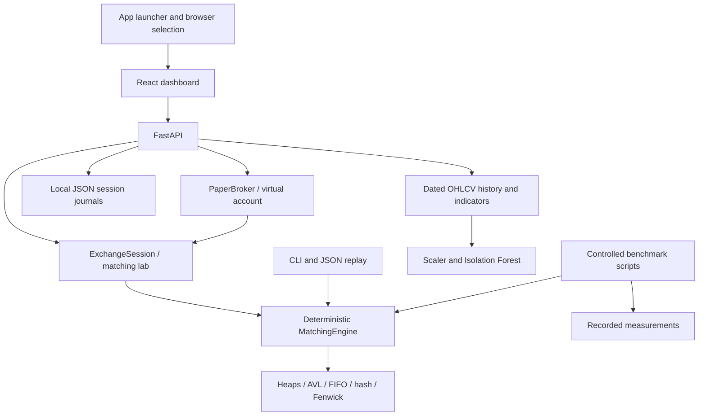

# Trade Velocity

**A stock-market order matching engine built with advanced data structures, a React dashboard, reproducible performance experiments, and historical anomaly detection.**

Trade Velocity is an educational MCA/ADSA project that explains how an electronic exchange organizes buy and sell orders and turns compatible orders into trades. Its Python engine applies **price-time priority** using custom queues, heaps, hash tables, AVL trees, and Fenwick trees. FastAPI exposes the engine to a React/TypeScript interface, while a separate scikit-learn pipeline analyzes historical market observations.

Repository: [sgshiv001/TRADE-VELOCITY](https://github.com/sgshiv001/TRADE-VELOCITY). Earlier backend and package names use **MarketLab** or **stock-matching-engine**; they are components of this same project.

**One project, one working folder:** the existing local folder named
`ADSA PROJECT` is this Trade Velocity project. Changing the project name does
not require a second folder or a nested `TRADE VELOCITY` copy. Open the original
folder in VS Code and run its root `app.py` or `app.bat`.

> Educational simulation. It does not connect to a live exchange or place real trades.

[Setup and demo](#quick-start) · [Architecture](#architecture) · [Data structures](#data-structures) · [AI analysis](#historical-anomaly-detection) · [Tests](#validation) · [Change log](CHANGELOG.md) · [Detailed development log](docs/development-log.md)

## Project description and objectives

A market receives orders at different prices and times. It must find the best compatible price, treat orders at the same price fairly, support partial execution and cancellation, and keep every index and quantity consistent. Scanning an unsorted list repeatedly becomes expensive as the number of price levels grows.

This project implements those rules explicitly, compares indexed books with list-based books, and makes the behavior understandable through repeatable examples. The academic objectives are correctness, explainable data-structure choices, measured time/memory costs, reproducible scenarios, and an analysis layer that never changes matching decisions. See the [problem statement](PROJECT_PROBLEM_STATEMENT.md) and [architecture report](docs/architecture.md).

## What it does

- **Trading:** buy and sell limit orders, market orders, partial fills, cancellation, and modification.
- **Order book:** multiple stocks, best bid and ask, FIFO at each price, and ordered market depth.
- **Analytics:** trade history, OHLC prices, VWAP, executed volume, volume-range queries, and most traded stocks.
- **Experiments:** deterministic generated orders, concurrent submission simulation, throughput and memory benchmarks, and indexed-versus-list price-book comparisons.
- **Reproducibility:** export a session to JSON, import it later, and download trades as CSV.
- **Market-data backend:** eight NSE companies, dated historical bars, adjusted-price indicators, moving averages, volume, growth, and drawdown calculations.
- **Paper-portfolio backend:** ₹10,00,000 virtual cash, matching-engine fills, average-cost holdings, realized/unrealized profit and loss, and saved local sessions. These operations are available through the API; the current React layout does not expose a complete portfolio trading screen.
- **React interface:** dark Trade Velocity landing page and eight pages: Engine, Order Book, DSA Lab, Simulator, Analytics, AI Monitor, Benchmark, and History.
- **Historical anomaly detection:** a StandardScaler + Isolation Forest pipeline with 13 features and explicit descriptions of historical order-flow proxies.
- **Complete app launcher:** builds React, starts FastAPI, asks for Edge/Chrome/Firefox/default browser, and opens the app once the server is ready. Windows batch files and VS Code launch configurations are included.

## Technology stack

| Layer | Technology |
| --- | --- |
| Matching and data structures | Python 3.10+, Decimal, threading, custom implementations |
| Local API | FastAPI, Uvicorn, Pydantic |
| Interface | React 19, TypeScript, Vite, Recharts, Lucide icons |
| Historical data | pandas, NumPy, yfinance, bundled dated JSON snapshot |
| Anomaly model | scikit-learn StandardScaler and Isolation Forest |
| Optional legacy dashboard | Streamlit |
| Testing and automation | pytest, FastAPI TestClient/httpx2, GitHub Actions |

## Quick start

Requires Python 3.10+ and Node.js 22 LTS. From the project folder:

```powershell
git clone https://github.com/sgshiv001/TRADE-VELOCITY.git
cd TRADE-VELOCITY
python -m venv .venv
.\.venv\Scripts\python.exe -m pip install --upgrade pip
.\.venv\Scripts\python.exe -m pip install -e ".[app,test]"
.\.venv\Scripts\python.exe app.py
```

Choose Edge, Chrome, Firefox, or your system default browser when prompted. The launcher builds React, serves both the app and API at **http://127.0.0.1:8000**, and opens your selected browser after startup. You can also double-click `app.bat`, or choose **Trade Velocity: Run App** in VS Code's Run and Debug menu and press F5. Keep the terminal open; Ctrl+C stops the server. On subsequent starts, add `--skip-build` to reuse the build, or use `--port 8001` for another port. Read the [app guide](docs/app-guide.md) for development commands, accounting rules, data provenance, and a complete walkthrough. The extracted [project problem statement](PROJECT_PROBLEM_STATEMENT.md) contains the submission framing, acceptance criteria, evidence checklist, and optional AI-analysis layer.

For macOS/Linux, create the same `.venv`, then use `.venv/bin/python` in place of `.venv\Scripts\python.exe`.

| Launch option | Behavior |
| --- | --- |
| `python app.py` | Ask for a browser, build the frontend, and start the app |
| `python app.py --skip-build` | Reuse the last frontend production build |
| `python app.py --port 8001` | Use another local port |
| `python app.py --browser chrome` | Select Chrome without the interactive prompt |
| `python app.py --no-browser` | Run the app and open its address manually |
| `python class_demo.py` | Print a matching walkthrough, then launch the app |
| `python class_demo.py --terminal-only` | Run only the deterministic terminal presentation |

The launcher prefers the project's `.venv` if it exists. A second launch reuses a running Trade Velocity server; it does not stop the server owned by another terminal. An occupied port belonging to another application produces an explanation and an alternative-port command.

## Classroom demonstration

1. Launch the app and choose a browser. Select **ENTER ENGINE**.
2. In **Engine**, select **Load demo flow** to execute the recorded scenario in the real Python engine.
3. Open **Order Book**, switch between ACME and TECH, and click a price level to inspect quantities, order counts, and FIFO priority.
4. Open **DSA Lab** to discuss the educational diagrams. Use the source and structure tests for actual heap operations and AVL rotations.
5. Select a historical company for **Analytics** and **AI Monitor**. Explain the dated input window and anomaly-model limitations.
6. Use **History** to inspect executions. For performance evidence, present the benchmark CSVs and [measured results](docs/results.md).

The terminal walkthrough includes a 250-share buy matched across asks at ₹105, ₹106, and ₹107, followed by a separate partial-fill example. See the [classroom guide](docs/classroom-demo.md).

### Current interface status

Engine demo execution, lab depth/history, historical API data, and the anomaly endpoint use the backend. The DSA diagrams are educational illustrations, not traces of actual structure mutations. The Simulator page currently animates synthetic counters; its scenario controls do not submit the selected workload to the engine. Use the CLI `simulate` command below for actual engine submissions. Some analytics widgets are demonstration graphics. The Benchmark page reads recorded files; run the scripts or API to produce new measurements, and consult the CSVs directly for complete results and their original column formats.

The backend's implemented capabilities are broader than the controls exposed in the current React layout.

## Market data and persistence

The bundled Yahoo Finance snapshot was fetched on **28 September 2026**. Daily bars may be delayed or incomplete. Charts and growth use adjusted prices; portfolio marks use raw daily Close. Supported historical companies are Reliance, TCS, Infosys, HDFC Bank, ICICI Bank, Bharti Airtel, L&T, and ITC. ACME and TECH are separate demonstration symbols; the defaults in `config/settings.py` are not the historical company universe.

The refresh API downloads updated history; failed refreshes preserve the existing snapshot. If the snapshot is missing or invalid, the backend clearly labels its simulated fallback. Market trades use synthetic liquidity and virtual funds. The bundled snapshot lets the classroom demo run without a market-provider request once dependencies are installed. Online refreshes and external fonts require internet access.

Successful local account/lab commands are saved as atomic JSON journals in `.marketlab/sessions/`. Browser storage retains a local session ID. These session files, virtual environments, installed dependencies, and build caches are excluded from Git. The MIT license covers project code; third-party market data remains subject to its provider's terms and provenance described in the [app guide](docs/app-guide.md).

## Historical anomaly detection

The AI layer is separate from the matching engine. `src/stock_engine/anomaly.py` builds a historical feature window and fits **StandardScaler + Isolation Forest** with 150 trees and random seed 42. It returns a normalized display score, flags, a recent timeline, the latest feature vector, and feature descriptions.

The 13 features are price, price change, volume, volatility, spread, buy volume, sell volume, order imbalance, order arrival rate, trade frequency, VWAP, VWAP deviation, and market depth. Daily OHLCV data does not provide exchange order messages: spread, buy/sell pressure, arrival rate, frequency, and depth fields use historical proxies.

The model currently fits and scores the same window. Its scores are relative unusualness within that window, not calibrated probabilities or validated predictions on unseen data. The displayed top features are standardized deviations, not causal explanations or model attributions. Anomaly flags do not prove fraud and do not control trades. Rule-based historical insights in `analysis.py` are a separate calculation.

Example endpoint: `GET /api/ai/anomalies/RELIANCE?period=1Y`.

## Optional Streamlit dashboard

The original Streamlit interface is available as an optional DSA demonstration:

```powershell
.\.venv\Scripts\python.exe -m pip install -e ".[dashboard]"
.\.venv\Scripts\python.exe -m streamlit run dashboard.py
```

Its [demonstration guide](docs/demo-guide.md) covers the legacy tabs.

## Terminal commands

```powershell
python -m stock_engine.cli demo
python -m stock_engine.cli run scenarios/demo.json
python -m stock_engine.cli benchmark --orders 100000 --seed 42
python -m stock_engine.cli simulate --orders 10000 --workers 4 --seed 42
python scripts/benchmark.py --sizes 1000,10000,100000 --repeats 3 --trace-memory
```

The last command writes a CSV to `benchmarks/results.csv`. To reproduce the data-structure comparison:

```powershell
python scripts/compare_engines.py --sizes 1000,5000,10000 --workloads mixed,deep,cancel --symbols 1 --seed 42 --repeats 3 --trace-memory
```

This writes `benchmarks/comparison.csv` after checking that both engines produce equal results. At 10,000 commands, the indexed book measured about **13.3× faster** for deep books and cancellation, while the list book was faster for the small eleven-price workload. See [measured results](docs/results.md) and [performance evaluation](docs/evaluation.md) for the full measurements and tradeoffs.

## Python API

```python
from stock_engine import MatchingEngine

engine = MatchingEngine()
engine.place_order("S1", "ACME", "SELL", 150, "105.00")
result = engine.place_order("B1", "ACME", "BUY", 100, "106.00")

assert result.trades[0].quantity == 100
assert str(result.trades[0].price) == "105.00"  # resting order's price
print(engine.order_book("ACME"))
print(engine.symbol_stats("ACME"))
```

Use `price=None` for a market order. Other methods include `cancel_order`, `modify_order`, `active_orders`, `trades`, `trade_by_id`, `traded_volume`, and `top_traded_stocks`. `modify_order(id, quantity, price)` replaces the order's **open** quantity and loses its previous time priority.

To record and replay a session:

```python
from stock_engine import ExchangeSession

session = ExchangeSession()
session.place_order("S1", "ACME", "SELL", 20, "100.00")
session.save("my-scenario.json")
restored = ExchangeSession.from_file("my-scenario.json")
```

## HTTP API

With the app running, open `http://127.0.0.1:8000/docs` for interactive API documentation.

| Area | Examples |
| --- | --- |
| Health and sessions | `GET /api/health`, `POST /api/session` |
| Market history | `GET /api/market`, `GET /api/companies/{symbol}`, `POST /api/market/refresh` |
| Historical analysis | `GET /api/analysis/{symbol}`, `GET /api/ai/anomalies/{symbol}` |
| Paper account | `GET /api/portfolio`, `POST /api/portfolio/orders`, demo/reset/export routes |
| Matching lab | `GET /api/lab`, `POST /api/lab/orders`, DELETE/PATCH order routes, demo/reset/import/export |
| Experiments | `GET /api/experiments` for recorded CSVs; `POST /api/experiments` for an isolated comparison |

Create a session first and send its returned ID as `X-Session-ID` for account and lab operations. This is local session separation, not production authentication. The health endpoint identifies this application so the launcher does not mistake another healthy service for Trade Velocity.

## Architecture



For each symbol, the engine maintains independent buy/sell books. It selects the best compatible opposite-side price, matches the oldest resting order there, updates quantities and statistics, and continues until filled or no compatible liquidity remains. AI is an analysis consumer and never participates in that decision. Detailed invariants, complexity assumptions, lazy heap deletion, resizing, and reference-engine behavior are in [docs/architecture.md](docs/architecture.md).

## Data structures

| Purpose | Implementation |
| --- | --- |
| Best bid and ask | Custom max and min binary heaps |
| Orders at the same price | Doubly linked FIFO queues |
| Find or cancel an order | Custom separate-chaining hash table |
| Direct price-level lookup | Custom hash table with resizing |
| Sorted price levels and market depth | Custom AVL trees |
| Volume over a trade range | Appendable Fenwick trees |
| Trade history and search | Dynamic array and binary search |
| Most traded stocks | Binary heap over symbol totals |

The core structures are implemented in [`src/stock_engine/structures.py`](src/stock_engine/structures.py). See [architecture and complexity](docs/architecture.md) for the matching algorithm, invariants, and operation costs.

## Project layout

```text
app.py / app.bat             Complete app launcher with browser selection
run_app.bat                  Compatible Windows entry point
class_demo.py                Deterministic classroom walkthrough
main.py                      Phase-1 setup check, not the full app launcher
config/                      Academic defaults and project paths
frontend/                    React, TypeScript, Recharts, responsive app
src/stock_engine/api.py      FastAPI and local session persistence
src/stock_engine/companies.py  Company profiles and source links
src/stock_engine/market_data.py  Historical data, provenance, indicators
src/stock_engine/analysis.py  Interpretable rule-based historical insights
src/stock_engine/anomaly.py   Feature engineering and Isolation Forest
src/stock_engine/portfolio.py  Paper execution and Decimal P/L accounting
src/stock_engine/data/       Dated bundled market snapshot
dashboard.py                 Optional legacy Streamlit interface
src/stock_engine/engine.py   Matching and order books
src/stock_engine/structures.py  Hash table, heaps, queues, AVL, Fenwick
src/stock_engine/session.py  JSON scenario recording and replay
src/stock_engine/cli.py      Demo, replay, benchmark, concurrency
src/stock_engine/experiments.py  Linear reference book and comparison harness
scenarios/demo.json          Example two-stock market
scripts/benchmark.py         Repeatable CSV performance experiment
scripts/compare_engines.py   Controlled indexed-versus-list experiment
scripts/run_app.py           Compatibility entry point for app.py
scripts/refresh_market_data.py  Update the historical snapshot
tests/                       Correctness and replay tests
docs/                        Design and evaluation notes
docs/development-log.md      Detailed development record and file inventory
CHANGELOG.md                 Features, fixes, limitations, and update history
CONTRIBUTING.md              How to validate and record future changes
data/ / reports/             Placeholder directories for future artifacts
.vscode/                     Shareable debug and build/run configurations
.github/workflows/tests.yml  Cross-platform CI
```

## Trading rules and scope

Each trade executes at the resting order's price. An unfilled limit-order remainder rests on the book; an unfilled market-order remainder expires. Partially filled resting orders keep their position. Order IDs are unique for one engine session, except that modification preserves the ID. Prices are positive rupee amounts with at most two decimal places; quantities are positive integers.

The engine protects each command with a lock. A concurrent run has a valid total order, although its exact matching sequence can vary with thread scheduling. Session JSON records successful commands for replay; trade timestamps are generated again during replay. React accounts are saved locally in `.marketlab/sessions` and restored after a server restart. Run the API with one worker on loopback. This educational app does not provide production authentication, a transactional database, live exchange connectivity, or real-money trading.

## Validation

```powershell
.\.venv\Scripts\python.exe -m pip install -e ".[app,dashboard,test]"
cd frontend
npm ci
npm run build
cd ..
.\.venv\Scripts\python.exe -m pytest -q
```

Build before running the entire suite so launcher integration tests can exercise the real frontend/API instead of skipping a missing build. The suite covers structure invariants, price/FIFO priority, lifecycle operations, independent reference matching, concurrent share conservation, scenario replay, market-data fallback, account isolation/persistence, anomaly reports, and occupied-port/server-cleanup behavior.

GitHub Actions runs Python checks on Ubuntu and Windows with Python 3.11 and 3.13, builds the frontend with Node.js 22, and exercises the launcher against that build. Test counts and durations are recorded in the [development log](docs/development-log.md) after actual runs; existing benchmark numbers are dated measurements, not guarantees for another machine.

## Change history and contributing

[CHANGELOG.md](CHANGELOG.md) records features, fixes, packaging, and known limitations. [docs/development-log.md](docs/development-log.md) gives the detailed development sequence, file inventory, validation evidence, and the distinction between original commits and later reconstructed milestones. Git history retains the original engine commits and the existing GitHub initialization commit.

For an exact committed audit, use:

```powershell
git log --all --date=iso-strict --format=fuller --stat
git log --all --name-status
git show <commit-id>
```

Follow [CONTRIBUTING.md](CONTRIBUTING.md) when changing the code: update the change log and relevant guide, run the appropriate checks, and commit with a description of the behavior changed. Git cannot reconstruct overwritten intermediate files that were never committed; the development log does not invent those diffs or timestamps.

## License

Project source is released under the [MIT License](LICENSE).
