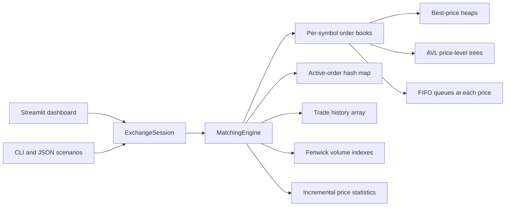

# Architecture and matching rules

## System overview

One `MatchingEngine` owns independent books for each stock symbol. Each book has a buy side and a sell side. The buy side uses a max heap to find its highest bid; the sell side uses a min heap to find its lowest ask. An AVL tree on each side keeps price levels ordered for market-depth queries. Each price level owns a doubly linked FIFO queue of orders. A hash map points from order ID to the order and its queue node, making cancellation direct.

## Matching algorithm

1. Validate the incoming order and assign an arrival sequence.
2. Read the best price on the opposite side.
3. For a limit order, stop if that price is outside the order's limit. A market order has no limit.
4. Match against the oldest order at that price. Execute the minimum remaining quantity at the **resting order's price**.
5. Update quantities, the trade history, volume index, and statistics. Remove an exhausted resting order and any empty price level.
6. Continue until the incoming order is filled or no compatible liquidity remains.
7. Rest the remainder of a limit order. Expire the remainder of a market order.

The engine holds an `RLock` throughout each command, so concurrent calls are serialized into one valid arrival order. Which thread arrives first depends on scheduling; once assigned, that order is matched deterministically.

## Invariants

- Every active order has exactly one queue node and one ID-map entry.
- A price level's quantity equals the sum of remaining shares in its queue.
- A symbol's best bid is lower than its best ask after an order finishes processing.
- Every trade has positive shares, one buy order ID, one sell order ID, and an increasing trade ID.
- Each trade reduces the buy and sell orders' remaining quantities by the same number of shares.
- A partially filled resting order keeps its queue position. Modification removes and reinserts it with a new arrival sequence.

## Complexity

Let `P` be active price levels on one side, `O` active orders, `T` executed trades, and `k` requested depth levels.

| Operation | Time | Why |
| --- | --- | --- |
| Inspect best bid or ask | `O(1)` normally | Heap root; stale entries may be popped |
| Rest an order at an existing price | `O(1)` | FIFO append and hash-map insert |
| Create a new price level | `O(log P)` | AVL insertion and heap insertion |
| Cancel an active order | `O(1)` normally; `O(log P)` if level empties | Hash lookup and linked-queue unlink, possibly AVL deletion |
| Query first `k` depth levels | `O(log P + k)` | Ordered AVL traversal |
| Find trade by ID | `O(log T)` | Binary search over trade array |
| Query trade-volume range | `O(log T)` | Two Fenwick prefix sums |
| Read current symbol statistics | `O(1)` | Updated incrementally on every trade |

An incoming order that executes against `m` resting orders has at least `O(m)` work. Empty level removals add AVL and heap work. Stale heap entries are removed lazily; the heap is rebuilt when it grows too large relative to active price levels, limiting long-run memory growth.

## Scenario format

`ExchangeSession` records successful `place`, `cancel`, and `modify` commands. JSON scenarios have `version: 1` and an ordered `events` array. Import replays the commands into a new engine, so the order book and trades can be reproduced. Trade timestamps are generated at replay time and therefore differ from the original run.

The session recorder is intended for single-threaded dashboard or CLI use. For concurrent experiments, submit directly to `MatchingEngine`; its lock protects matching.
