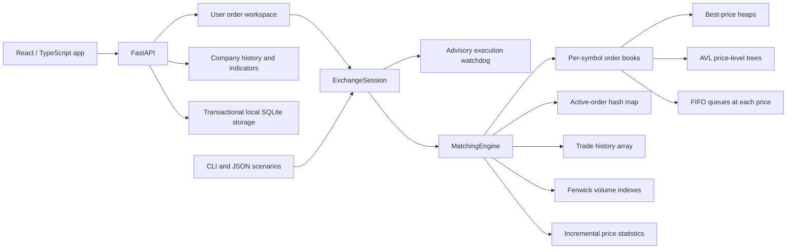

# Architecture and matching rules

## System overview

One `MatchingEngine` owns independent books for each stock symbol. Each book has a buy side and a sell side. The buy side uses a max heap to find its highest bid; the sell side uses a min heap to find its lowest ask. An AVL tree on each side keeps price levels ordered for market-depth queries. Each price level owns a doubly linked FIFO queue of orders. A custom hash table points from order ID to the order and its queue node, making cancellation direct. A second custom hash table maps prices to active levels, so ordinary best-price lookup, insertion at an existing price, and cancellation within a level avoid AVL searches.

`HashTable` resolves collisions with linked chains, doubles its bucket count above a 75% load factor, and halves it below 12.5% (with a minimum of eight buckets). Resize reuses entries and cached hashes. Lookup is expected constant time; a collision chain can take linear time. The project uses Python dictionaries for symbol routing and statistics, a Python set to prevent reuse of order IDs, and Python lists as dynamic arrays for trade history.

## Matching algorithm

1. Validate the incoming order and assign an arrival sequence.
2. Read the best price on the opposite side.
3. For a limit order, stop if that price is outside the order's limit. A market order has no limit.
4. Match against the oldest order at that price. Execute the minimum remaining quantity at the **resting order's price**.
5. Update quantities, the trade history, volume index, and statistics. Remove an exhausted resting order and any empty price level.
6. Continue until the incoming order is filled or no compatible liquidity remains.
7. Rest the remainder of a limit order. Expire the remainder of a market order.

The engine holds an `RLock` throughout each command, so concurrent calls are serialized into one valid arrival order. Which thread arrives first depends on scheduling; once assigned, that order is matched deterministically.

## Invariants

- Every active order has exactly one queue node and one ID-map entry.
- A price level's quantity equals the sum of remaining shares in its queue.
- A symbol's best bid is lower than its best ask after an order finishes processing.
- Every trade has positive shares, one buy order ID, one sell order ID, and an increasing trade ID.
- Each trade reduces the buy and sell orders' remaining quantities by the same number of shares.
- A partially filled resting order keeps its queue position. Modification removes and reinserts it with a new arrival sequence.

## Complexity

Let `P` be active price levels on one side, `O` active orders, `T` executed trades, `S` traded symbols, and `k` requested results. Hash-table bounds assume well-distributed hashes. Resize costs are amortized; they can make an individual insertion or deletion linear.

| Operation | Time | Why |
| --- | --- | --- |
| Find an active order by ID | Expected `O(1)` | Custom hash-table lookup |
| Inspect best bid or ask | Expected `O(1)` with a current root | Heap root and price-level hash lookup |
| Rest an order at an existing price | Amortized expected `O(1)` | Hash lookup, FIFO append, order-ID insert |
| Create a new price level | Amortized expected `O(log(P + 1))` | AVL insertion and heap insertion |
| Cancel an active order | Amortized expected `O(1)`; `O(log(P + 1))` if level empties | Hash lookup and queue unlink, possibly AVL deletion |
| Query first `k` depth levels | `O(log P + k)` | Ordered AVL traversal |
| Record an executed trade | Amortized `O(log(T + 1))` | Dynamic-array appends, Fenwick update, incremental totals |
| Find trade by ID | `O(log T)` | Binary search over trade array |
| Query trade-volume range | `O(log T)` | Two Fenwick prefix sums |
| Read current symbol statistics | `O(1)` | Updated incrementally on every trade |
| Top `k` traded stocks | `O(S + k log(S + 1))` | Linear heap construction, then extract up to `k` entries |
| List active orders in arrival order | Expected `O(O log(O + 1))` | Hash-table iteration and sequence sorting |

An incoming order that executes against `m` resting orders records `m` trades. Its amortized expected cost is `O(m log(T + 1) + (m + 1) log(P + 1))`, plus any accumulated stale-root cleanup; a no-match order at an existing price can take expected constant time. `P` here bounds the levels on either side during processing. Fenwick updates count in the matching cost, even when no price level is removed.

Cancellation immediately removes the FIFO node and ID-map entry. Heap entries are deleted lazily: each contains a price and a generation token, so a canceled and later recreated price cannot revive an old entry. A best-price query that discards `s` stale entries takes `O(s log(P + 1))` heap work. Each stale entry is popped at most once or discarded during compaction. When the heap exceeds `2P + 64` entries it is rebuilt with bottom-up heap construction, taking expected `O(P)` work amortized over prior removals. Fenwick capacity doubles with a linear rebuild; an individual growing append can take `O(T)`, while appends remain amortized `O(log(T + 1))`.

Core storage is `O(U + O + P + T + S)`, where `U` counts all used order IDs, including filled and canceled orders. Keeping those IDs and the complete trade history makes memory grow with the session. The heap's lazy entries remain bounded relative to active levels; the session recorder separately keeps its command log.

## Comparison engine

`LinearMatchingEngine` in `experiments.py` replaces only the price-level books with unsorted lists. It inherits the production matching algorithm, validation, order-ID table, FIFO queues, lock, trade history, Fenwick updates, and statistics. This isolates price-level indexing in the performance comparison. It is not an independent implementation of the matching algorithm; the separate list-based matchers in the correctness tests provide that independent check.

| Price-level operation | Indexed book | Unsorted list book |
| --- | --- | --- |
| Find best price with a current heap root | Expected `O(1)` | `O(P)` scan |
| Append at an existing price | Amortized expected `O(1)` | `O(P)` search |
| Create a price level | Amortized expected `O(log(P + 1))` | `O(P)` duplicate check, then append |
| Remove an order at a known price | Amortized expected `O(1)`, plus `O(log(P + 1))` if level empties | `O(P)` search and possible list removal |
| First `k` depth levels | `O(log(P + 1) + k)` | `O(P log(P + 1))` sort, then slice |

Building and draining `N/2` distinct levels for one symbol gives amortized expected `O(N log N)` command processing with the indexed book and `O(N²)` price-level work with the list book. Building and canceling distinct levels has the same contrast. With only eleven possible prices, `P` stays small and Python's simple list operations can have lower constant overhead; the measured comparison includes that case.

## Scenario format

`ExchangeSession` records successful `place`, `cancel`, and `modify` commands.
Current exports have `version: 2`, an ordered `events` array, and immutable
command/execution timestamps that survive replay. Version-1 scenarios remain
readable; their original execution times are unknown and displayed as such.
Import validates commands by rebuilding the book, trades, and execution features
in a new engine rather than trusting supplied telemetry.

The session recorder is intended for sequential API or CLI commands. For concurrent experiments, submit directly to `MatchingEngine`; its lock protects matching.
## Desktop and execution-observer extension

The optional desktop host (`stock_engine.desktop`) embeds the same production
React frontend in a native pywebview/WebView2 window and starts one owned Uvicorn
server on loopback. Browser launch remains available. The desktop uses a reserved
port, an occupied-port fallback, separate writable per-user storage, and server
shutdown when its window closes. PyInstaller includes the frontend,
package snapshot, Python runtime, and dependencies. WebView2 is a target-machine
prerequisite. No remote broker connection or real-money execution is introduced.

Successful session commands derive execution observations. Only commands that
produce fills add model observations; each observation aggregates the fills
of that command using a volume-weighted executed price. It includes event/order
references, matched quantity, submitted quantity, fill count, price change from
the previous observation, and pre-command bid/ask volume/imbalance in the top 30
levels. Telemetry is outside deterministic matching and reconstructed on replay.
Version-2 timestamps survive replay; legacy records without timestamps remain
explicitly unknown. A local clock is not a trusted exchange audit clock.

The watchdog groups observations by symbol. Of the first 40 executions, the
first 24 fit an Isolation Forest and robust median/MAD statistics; the next 16
set fixed cutoffs without fitting the forest or robust statistics. Positive
count/depth features are log-transformed. Later executions trigger a review if
either the calibrated forest cutoff or an explicit robust-deviation guard is
exceeded. Forest alerts require corroborating robust deviation; raw count/depth
envelopes supplement the logged guards when baseline variability is large.
Offline parameter selection uses development workloads, not held-out
evaluation labels; [the calibration report](ai-calibration-report.md) records
the protocol, misses, false alerts, and detector contributions.

Baseline normality is assumed, not verified. Severity is not a probability;
feature-deviation labels are descriptive, not causal forest explanations.
Models and unchanged reports are cached outside the matching lock. Monitoring uses only
the user's executed orders. Generated classroom sessions and evaluation controls
were removed on 30 September 2026. Historical OHLCV anomaly analysis remains
a separate pipeline. No liquidity is automatically added to a new session.

## Local boundary and optional private access

Local launches remain loopback-only. Host/client/origin checks cover HTTP and
WebSockets; responses carry CSP and other security headers. Optional private
mode requires an HTTPS origin plus a non-placeholder 32+ character access key.
It uses an eight-hour, Secure/HTTP-only/SameSite=Strict cookie with server-side
revocation, or explicit bearer credentials for trusted API clients. The UI does
not store the key. Rate/body/concurrency limits bound requests; docs endpoints
are disabled. Login state is in-memory and reset on restart. This is one trusted
operator/workspace boundary, not individual multi-user ownership isolation.

The prepared container/proxy templates are unexecuted on this host; normal app
launch does not deploy them. See [private deployment](private-deployment.md).
