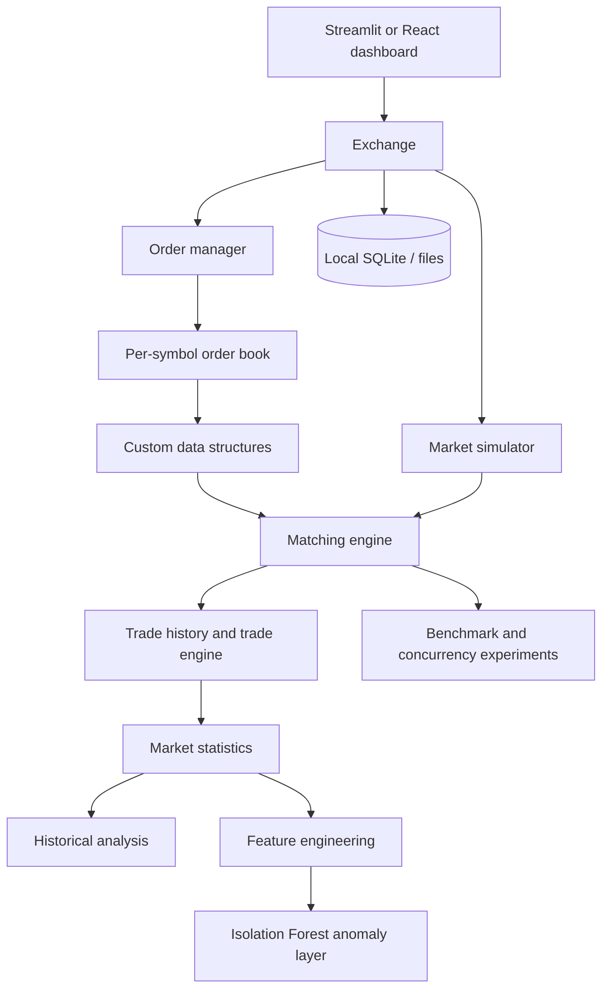

# Trade Velocity — Phase 1: Project Setup

## 1. Project introduction

Trade Velocity is an educational stock-market simulation. Its central
component is a deterministic order-matching engine that applies price-time
priority. Market simulation, performance measurement, analytics, and AI
anomaly detection are extensions around that core. The project never connects
to a live exchange and does not provide financial advice.

## 2. Problem statement

An electronic market must accept many buy and sell orders, keep them organized,
match compatible orders quickly, preserve fairness, and report the resulting
trades. A basic list-based implementation makes these rules difficult to
explain and inefficient to scale. Trade Velocity studies how explicit data
structures—queues, heaps, hash tables, AVL trees, and Fenwick trees—can model
these responsibilities and how their behavior can be measured.

## 3. Objectives

1. Build a correct price-time-priority matching engine.
2. Implement the important educational data structures from scratch.
3. Support limit/market orders, partial fills, cancellation, modification,
   and multiple symbols.
4. Simulate market conditions and measure actual runtime and memory usage.
5. Generate market features and identify potentially anomalous activity with
   an Isolation Forest model.
6. Present the system through a dashboard and explain its algorithms in a
   semester-project report.

## 4. Scope

Included: synthetic orders, deterministic matching, local analytics, local
SQLite-ready persistence, reproducible experiments, tests, and an optional
dashboard. Excluded: live trading, brokerage connectivity, guaranteed price
prediction, fraud conclusions, and fabricated benchmark or ML results.

## 5. Why this fits an MCA AI semester project

The project combines DSA implementation, object-oriented Python, algorithmic
complexity, data handling, software testing, concurrency, performance
engineering, and unsupervised machine learning. The AI layer analyzes output
from the deterministic engine; it does not make or alter trading decisions.

## 6. Architecture



The current repository already contains the core implementation under
`src/stock_engine/`; future phases can split modules further only when that
improves clarity. This avoids duplicating working code in parallel package
trees.

## 7. Technology stack

- Python 3.10+ (the repository currently supports Python 3.10 and newer).
- Standard library: `dataclasses`, `enum`, `typing`, `threading`,
  `concurrent.futures`, `time`, `tracemalloc`, `csv`, and `json`.
- NumPy, Pandas, and scikit-learn for data and AI experiments.
- Matplotlib and Plotly for visualisation; Streamlit for the optional dashboard.
- pytest for automated tests.
- SQLite is available through Python's standard `sqlite3` module when the
  persistence phase is implemented.

## 8. Folder structure

```text
trade-velocity/
├── README.md
├── LICENSE
├── requirements.txt
├── pyproject.toml
├── .gitignore
├── main.py
├── config/
│   └── settings.py
├── src/stock_engine/
│   ├── models.py              # current order/trade data models
│   ├── structures.py          # custom queue, heaps, hash table, AVL, Fenwick
│   ├── engine.py              # matching and order-book logic
│   ├── analysis.py            # market analytics
│   ├── experiments.py         # benchmark/reference experiments
│   ├── session.py             # local scenario persistence
│   └── cli.py                 # command-line demonstrations
├── dashboard.py
├── scripts/
├── tests/
├── data/
├── benchmarks/
├── docs/
└── reports/
```

The requested conceptual modules—core, simulator, analytics, AI, benchmarks,
and dashboard—map to the existing `src/stock_engine` modules and can be
separated in later phases if needed.

## 9. Python environment setup

From PowerShell in the repository root:

```powershell
py -3.12 -m venv .venv
.\.venv\Scripts\Activate.ps1
python -m pip install --upgrade pip
python -m pip install -r requirements.txt
python -m pip install -e .
```

If Python 3.12 is not installed, use another Python 3.10+ interpreter and
keep the same virtual-environment commands.

## 10. Installation and verification

```powershell
python main.py
python -m pytest -q
python -m stock_engine.cli demo
```

The first command checks configuration. The second runs automated tests. The
third executes a small deterministic matching demonstration.

## 11. Expected setup output

```text
Trade Velocity setup is ready.
Configured stocks: AAPL, MSFT, NVDA, TSLA, AMZN, GOOGL, META
Next step: implement and study the Order model in Phase 2.
```

The exact test count and benchmark values must come from the current execution;
they must not be written into the report in advance.

## 12. Initial Git commands

Review the files before committing, because this repository may contain work
from earlier development:

```powershell
git status
git diff -- config main.py requirements.txt tests/test_phase1_setup.py docs/phase1_project_setup.md
git add config main.py requirements.txt tests/test_phase1_setup.py docs/phase1_project_setup.md
git commit -m "add Trade Velocity Phase 1 project setup"
```

## 13. Beginner notes

- A virtual environment keeps project packages separate from system Python.
- `requirements.txt` records the libraries expected by the project.
- `config/settings.py` keeps defaults in one place so experiments are easier to
  reproduce.
- A smoke test is a small test that answers: “Can the project load and start?”
- The matching engine is the academic core. The dashboard and AI layer are
  clients of its results, not replacements for its deterministic rules.
